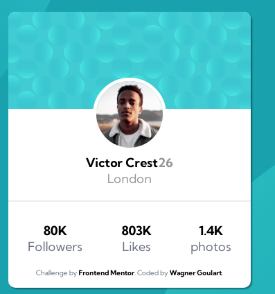

# Frontend Mentor - Profile card component solution

This is a solution to the [Profile card component challenge on Frontend Mentor](https://www.frontendmentor.io/challenges/profile-card-component-cfArpWshJ). Frontend Mentor challenges help you improve your coding skills by building realistic projects. 

## Overview

### The challenge

- Build out the project to the designs provided

### Screenshot
<br>




### Links

- Live Site URL: [Deploy](https://wagner-goulart.github.io/profile-card-component-main/)

### Built with

- Semantic HTML5 markup
- CSS custom properties
- Flexbox

### What I learned

In the project are tow images, one stays on the top-left and another bottom-right,
I have some issues to put them in the right place, try to positiong using position absolute, but always created a horizontal and vertical scroll.

I fix it with postion fixed, and the scrolls are gone.

```css
.imagem-padrao-topo img {
    position: fixed;
    right:55%;
    bottom: 40%;
}

.imagem-padrao-fundo {
    position: fixed;
    top: 40%;
    left: 50%;
    width: 70%;
}

